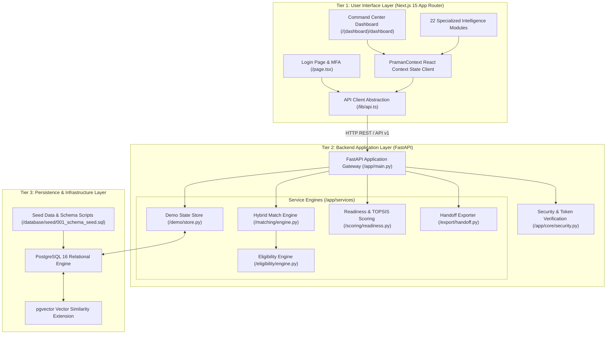
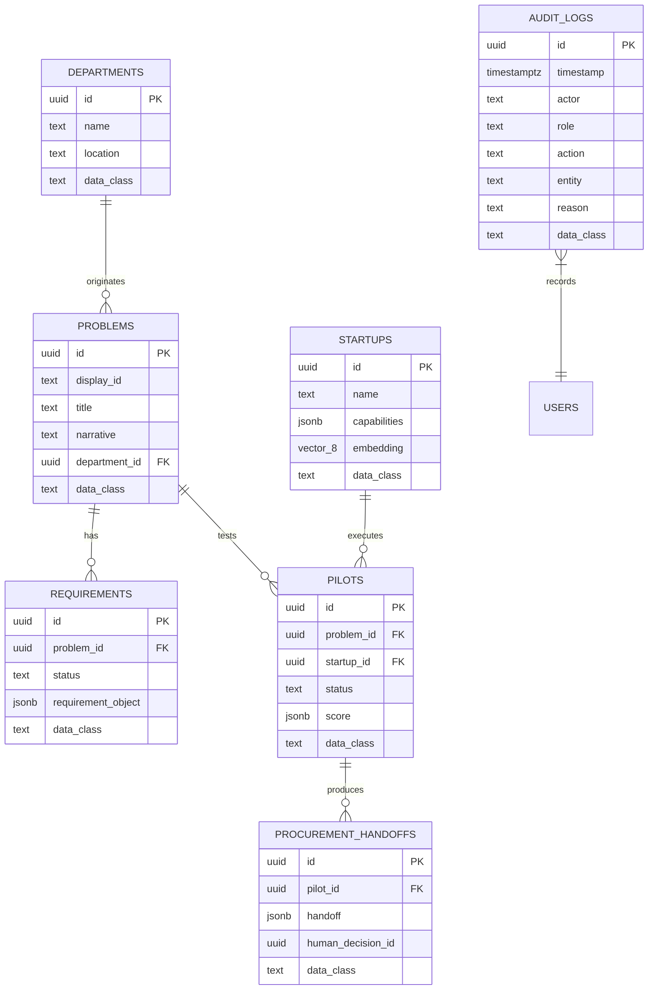
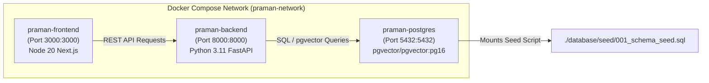
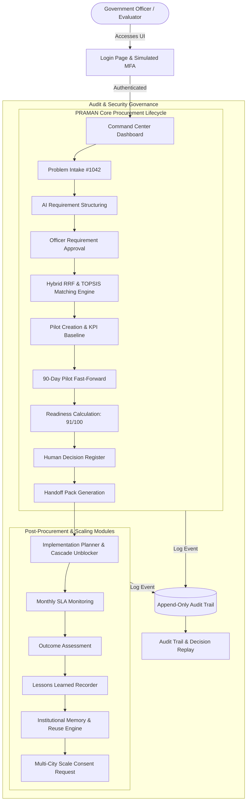

# SYSTEM.md — PRAMAN System Architecture & Technical Documentation

> **PRAMAN**: Pilot Readiness Assessment, Matching And Navigation  
> **Problem Statement**: SIH26136 — Startup-Friendly Public Procurement Mechanism  
> **Context**: Smart India Hackathon (SIH) 2026 Prototype — Government of Maharashtra  
> **Documentation Version**: 1.0.0 (Source of Truth Audit)  

---

## 1. FIRST: DEEPLY ANALYSED PROJECT SUMMARY

This documentation file is constructed directly from an exhaustive audit of the actual codebase located at `e:\sih16Sep\praman`. No functionality is assumed; every claim is tied directly to source files, API endpoints, SQL schemas, frontend routes, and deterministic service modules.

### Architectural Core
* **Frontend**: Next.js 15.1.2 App Router (TypeScript strict mode), Tailwind CSS 3.4.17, Lucide React icons, Recharts 2.15.0, Framer Motion 11.15.0.
* **Backend**: FastAPI 0.115.6 (Python 3.11+), Pydantic 2.10.4 validation schemas, Python-JOSE JWT authentication, Passlib password hashing, Pytest test suite.
* **Database & Vector Store**: PostgreSQL 16 with `pgvector` 0.3.6 extension, UUID primary keys, and JSONB fields for dynamic requirement and evaluation payloads.
* **Containerization**: Multi-stage Docker Compose orchestration (`docker-compose.yml`) running `praman-postgres`, `praman-backend`, and `praman-frontend` on shared container networks.
* **Offline Deterministic Fallback**: A fully standalone local engine (`LOCAL DEMO ENGINE`) providing reproducible judge demonstrations without requiring external LLM APIs (OpenAI/Gemini), live government registries (DPIIT/GeM/CPPP), or cloud vector databases.

---

## 2. EXPLAIN WHAT THE SYSTEM ACTUALLY DOES

### Simple Explanation
Imagine a government department (like the Public Works Department in Pune) that has a problem: potholes on city bus routes are taking weeks to identify. Local startups have AI camera solutions that can detect potholes automatically, but government officers cannot easily procure them due to complex procurement rules, lack of objective risk evaluation, and fear of audit failure. 

**PRAMAN** acts as an evidence-backed digital bridge. It takes a plain-text problem from a government officer, structures it into technical specifications using AI, scans registered startups for eligibility and capability match, supervises a 90-day pilot project, computes an objective **Procurement Readiness Score (0–100)**, generates an **Audit-Ready Procurement Handoff Pack**, tracks post-award implementation dependencies, and records lessons learned in an institutional memory system for other cities (like Mumbai or Nashik) to reuse.

### Technical Explanation
PRAMAN is a full-stack procurement decision-support platform designed to streamline public procurement of innovative solutions. It implements a multi-stage deterministic pipeline:
1. **Intake & NLP Structuring**: Converts unformatted department problem narratives into structured JSON schema requirements with specific target KPIs.
2. **Hybrid Retrieval & Decision Scoring**: Merges BM25 lexical keyword matching with dense vector representation via Reciprocal Rank Fusion (RRF), followed by TOPSIS (Technique for Order of Preference by Similarity to Ideal Solution) multi-criteria score aggregation to rank candidate startups.
3. **Controlled Pilot Evaluation**: Tracks real-time field pilot performance metrics against baseline KPIs.
4. **Multi-Dimensional Readiness Engine**: Calculates a composite 0–100 readiness score across 10 operational and security dimensions while flagging active governance blockers (e.g., incomplete security questionnaires).
5. **Human-in-the-Loop Audit Handoff**: Captures mandatory officer justification reasons and generates an immutable, audit-trailed procurement review handoff package.
6. **Post-Procurement Lifecycle Management**: Provides dependency graph resolution, cascade blocker management, monthly SLA monitoring, outcome validation, and cross-department reuse intelligence.

---

## 3. COMPLETE ARCHITECTURE

PRAMAN follows a 3-tier architecture with modular service layers:



### Component Breakdown

| Component Name | Layer | Purpose & Responsibilities | Key Inputs | Key Outputs | Location in Codebase |
| :--- | :--- | :--- | :--- | :--- | :--- |
| **PramanProvider** | Frontend State | Global React Context state store managing active stage, auth token, and API sync. | User interactions, API responses | Reactive UI state, trigger methods | `frontend/lib/PramanContext.tsx` |
| **Shell Component** | Frontend UI | App layout, government header branding, sidebar navigation, and mobile drawer. | Route path, active user profile | Structured application frame | `frontend/components/Shell.tsx` |
| **FastAPI Gateway** | Backend API | HTTP routing, CORS handling, payload validation, and endpoint handlers. | HTTP Requests (JSON) | HTTP Responses (JSON) | `backend/app/main.py` |
| **Demo Store (`STATE`)** | Backend Store | In-memory state holding hero scenario, users, pilots, tasks, risks, and memory. | Reset calls, mutation endpoints | State dictionaries, audit logs | `backend/app/services/demo/store.py` |
| **Eligibility Engine** | Business Logic | Evaluates startup compliance against mandatory government criteria (`ELG-001`–`014`). | Startup record, Problem record | Pass/Fail compliance object | `backend/app/services/eligibility/engine.py` |
| **Matching Engine** | AI/Logic | Executes BM25 lexical search + dense fit ranking + RRF fusion + TOPSIS aggregation. | Startups list, Problem requirement | Ranked recommendation list | `backend/app/services/matching/engine.py` |
| **Readiness Engine** | Business Logic | Aggregates pilot performance and compliance metrics into a 0–100 score + blocker. | Pilot KPIs, security status | Readiness breakdown (91/100) | `backend/app/services/scoring/readiness.py` |
| **Handoff Generator** | Business Logic | Compiles problem, requirement, startup, pilot evidence, and readiness into handoff pack. | Complete hero state slice | Audit-ready handoff JSON | `backend/app/services/export/handoff.py` |
| **PostgreSQL 16** | Database | Stores structured tables (`problems`, `startups`, `pilots`, `audit_logs`) and vector embeddings. | SQL queries, vector queries | Relational records, similarity ranks | `database/seed/001_schema_seed.sql` |

---

## 4. TECH STACK

| Layer | Technology | Exact Version | Purpose in System | Where Used in Codebase |
| :--- | :--- | :--- | :--- | :--- |
| **Frontend Framework** | Next.js (App Router) | `^15.1.2` | Core Web Application Framework | `frontend/package.json`, `frontend/app/` |
| **UI Library** | React | `^19.0.0` | Client UI Component Rendering | `frontend/package.json` |
| **Language (FE)** | TypeScript | `^5.7.2` | Strict Type Checking & Interface Definitions | `frontend/tsconfig.json`, `frontend/types/` |
| **Styling** | Tailwind CSS | `^3.4.17` | Utility-first CSS & Government Theme Tokens | `frontend/tailwind.config.ts`, `frontend/app/globals.css` |
| **Icons** | Lucide React | `^0.468.0` | UI Icon System | `frontend/components/Shell.tsx`, `frontend/components/ui.tsx` |
| **Charting** | Recharts | `^2.15.0` | Data Visualization for Metrics & Risk Radar | `frontend/app/(dashboard)/analytics/page.tsx` |
| **Animations** | Framer Motion | `^11.15.0` | Micro-animations and page transitions | `frontend/package.json` |
| **Backend Framework** | FastAPI | `0.115.6` | High-performance Async REST API Framework | `backend/requirements.txt`, `backend/app/main.py` |
| **WSGI/ASGI Server** | Uvicorn | `0.34.0` | ASGI Server for FastAPI | `backend/requirements.txt`, `backend/Dockerfile` |
| **Data Validation** | Pydantic | `2.10.4` | Data Validation and Schema Serialization | `backend/app/main.py` |
| **Language (BE)** | Python | `3.11+` | Backend Runtime & Service Logic | `backend/Dockerfile` |
| **Authentication** | Python-JOSE / Passlib | `3.3.0` / `1.7.4` | JWT Token Generation & Password Hashing | `backend/app/core/security.py` |
| **Database** | PostgreSQL | `16` | Main Relational Database Engine | `docker-compose.yml`, `database/seed/` |
| **Vector Extension** | pgvector | `0.3.6` | 8-Dimensional Capability Vector Similarity | `database/seed/001_schema_seed.sql` |
| **Database Driver** | SQLAlchemy / Psycopg | `2.0.36` / `3.2.3` | Database ORM & PostgreSQL Driver | `backend/requirements.txt` |
| **Backend Testing** | Pytest / HTTPX | `8.3.4` / `0.28.1` | Automated Unit & Integration Testing | `backend/tests/` |
| **Containerization** | Docker / Docker Compose | `2.x+` | Multi-container Environment Orchestration | `docker-compose.yml`, `frontend/Dockerfile`, `backend/Dockerfile` |

---

## 5. PROJECT DIRECTORY EXPLANATION

```text
praman/
├── .env.example                # Sample environment configuration file
├── docker-compose.yml          # Container configuration for Postgres, Backend, Frontend
├── README.md                   # Project overview and hero scenario guide
├── vercel.json                 # Vercel deployment routing configuration
├── backend/
│   ├── Dockerfile              # Python 3.11 FastAPI container definition
│   ├── requirements.txt        # Python dependency specifications
│   ├── app/
│   │   ├── main.py             # FastAPI entry point, CORS, models, and 30+ endpoints
│   │   ├── core/
│   │   │   ├── config.py       # Pydantic Settings management
│   │   │   └── security.py     # JWT token creation and verification
│   │   └── services/
│   │       ├── demo/
│   │       │   └── store.py    # In-memory hero state store & initial datasets
│   │       ├── eligibility/
│   │       │   └── engine.py   # Rule-based eligibility check logic
│   │       ├── export/
│   │       │   └── handoff.py  # Handoff pack generation logic
│   │       ├── matching/
│   │       │   └── engine.py   # BM25 + Dense + RRF + TOPSIS matching engine
│   │       └── scoring/
│   │           └── readiness.py # Pilot success & readiness score calculations
│   └── tests/
│       ├── test_engines.py     # Engine unit tests (RRF, TOPSIS, readiness)
│       └── test_workflow.py    # End-to-end FastAPI endpoint workflow test
├── database/
│   ├── migrations/
│   │   └── README.md           # Intended production schema migration notes
│   └── seed/
│       └── 001_schema_seed.sql # Initial SQL schema and pgvector seed data
└── frontend/
    ├── Dockerfile              # Node 20 Next.js container definition
    ├── next.config.mjs         # Next.js build configuration
    ├── package.json            # Node.js dependencies and script definitions
    ├── postcss.config.mjs      # PostCSS configuration for Tailwind
    ├── tailwind.config.ts      # Tailwind styling tokens and custom colors
    ├── tsconfig.json           # TypeScript configuration settings
    ├── components/
    │   ├── Badge.tsx           # Status and data class badge component
    │   ├── EvidenceGraph.tsx   # Interactive visual evidence chain diagram
    │   ├── EvidenceTrace.tsx   # "Why? How? From What?" evidence trace drawer
    │   ├── Shell.tsx           # Main dashboard layout, header branding, and sidebar
    │   └── ui.tsx              # Reusable UI primitives (Panel, Action, StatCard, etc.)
    ├── lib/
    │   ├── api.ts              # API fetch client wrapper with error handling
    │   └── PramanContext.tsx   # Global React context state & API action bindings
    ├── types/
    │   └── praman.ts           # TypeScript interfaces for all system entities
    └── app/
        ├── globals.css         # CSS custom properties and theme variables
        ├── layout.tsx          # Root HTML layout & font configuration
        ├── page.tsx            # Login & Simulated MFA page
        ├── providers.tsx       # React Context provider wrapper
        └── (dashboard)/        # Dashboard route group
            ├── analytics/      # Performance analytics & SLA tracking
            ├── audit/          # Append-only audit trail viewer
            ├── dashboard/      # Main Command Center Overview
            ├── decisions/      # Recommendations & Human Decision Register
            ├── evidence/       # Evidence Locker & verification status
            ├── handoff/        # Procurement Review Handoff Package view/export
            ├── implementation/ # Implementation planner & dependency graph
            ├── lessons/        # Lessons learned recorder & summary
            ├── matching/       # Startup discovery, ranking & dimension breakdown
            ├── memory/         # Institutional memory search & historical projects
            ├── monitoring/     # Post-deployment SLA monitoring
            ├── outcomes/       # Project outcome recording & variance analysis
            ├── pilots/         # Controlled pilot workspace & KPI fast-forward
            ├── problems/       # Problem intake & NLP requirement structuring
            ├── readiness/      # Procurement readiness assessment (0-100)
            ├── replay/         # Decision replay engine & model audit
            ├── requirements/   # Structured requirement review & officer approval
            ├── reuse/          # Solution reuse intelligence & recommendations
            ├── risk/           # Risk radar breakdown across 6 categories
            ├── scale/          # Multi-city scaling & department consent requests
            ├── settings/       # System configuration & environment status
            └── transparency/   # Public transparency portal view
```

---

## 6. COMPLETE USER WORKFLOW

The complete user workflow spans 10 sequential operational stages:

```text
[1. User Login] 
  ↓ (officer@praman.local + MFA: 123456)
[2. Intake & Problem Selection] 
  ↓ (Select Problem #1042: Pune Bus Pothole Detection)
[3. Structure Requirements] 
  ↓ (POST /api/v1/problems/1042/structure → req-1042-v1)
[4. Requirement Approval] 
  ↓ (POST /api/v1/problems/1042/requirements/approve → Approved)
[5. Run Matching Engine] 
  ↓ (POST /api/v1/match → RRF Ranking: SkylineAI #1 at 93/100)
[6. Shortlist & Launch Pilot] 
  ↓ (POST /api/v1/recommendations/rec-startup-skyline/shortlist)
[7. Fast-Forward Pilot & Upload Evidence] 
  ↓ (POST /api/v1/pilots/pilot-1042-skyline/fast-forward)
[8. Calculate Procurement Readiness] 
  ↓ (POST /api/v1/procurement-readiness/pilot-1042-skyline/calculate → 91/100 with Security Blocker)
[9. Submit Human Decision Reason] 
  ↓ (POST /api/v1/decisions → "Proceed to Procurement Review")
[10. Generate Handoff Pack & Request Scale Consent] 
  ↓ (POST /api/v1/export/handoff/pilot-1042-skyline + POST /api/v1/scale-recommendations/scale-mumbai/request-consent)
[11. Post-Procurement Implementation & Monitoring]
  ↓ (PATCH /api/v1/implementation/1042/tasks/task-02/resolve-blocker → Unblock downstream tasks)
```

---

## 7. COMPLETE INTERNAL DATA FLOW

### Detailed Workflow Step Analysis

#### Step A: Requirement Structuring
* **Input**: Unstructured problem narrative string (`narrative` in Problem #1042).
* **Validation**: Checks if `problem_id == "1042"`.
* **Processing**: Generates structured JSON schema with target KPIs, budget bounds, timeline, constraints, and data requirements.
* **Transformation**: Creates requirement object with status `Generated`.
* **Storage**: Saved in memory state under `STATE["requirements"]["1042"]`.
* **Output**: `Requirement` schema object returned to frontend.
* **UI**: Displays structured requirement card in `/requirements` with an "Approve Requirement" CTA.

#### Step B: Startup Matching Engine
* **Input**: Approved `Requirement` object + List of registered `Startups` (`STATE["startups"]`).
* **Validation**: Verifies `requirement["status"] == "Approved"`.
* **Processing**:
  1. **BM25 Lexical Rank**: Tokenizes narrative + technology terms and counts term overlaps against startup capability strings (`bm25_rank`).
  2. **Dense Vector Interface**: Ranks startups by vector similarity score (represented by `Technology Fit` dimension).
  3. **Reciprocal Rank Fusion (RRF)**: Merges ranks using score formula \( S_{RRF}(d) = \sum_{m \in M} \frac{1}{60 + r_m(d)} \).
  4. **TOPSIS Score Aggregation**: Computes weighted score across 7 dimensions (Problem Fit 25%, Technology Fit 20%, Eligibility 15%, Deployment Readiness 15%, Pilot Capacity 10%, Budget 10%, Evidence 5%).
* **Output**: Ranked recommendation list with `SkylineAI Solutions` scored at 93/100.
* **UI**: Renders interactive recommendation table in `/matching` with capability match tags and dimension breakdown.

#### Step C: Procurement Readiness Calculation
* **Input**: Completed Pilot state + Uploaded Evidence Locker files (`STATE["evidence"]`).
* **Validation**: Requires `pilot["success"]` to exist.
* **Processing**: Evaluates 10 readiness dimensions (Pilot Success 91, Evidence Completeness 85, Security 80, Reliability 96, Cost 91, UX 88, Scalability 84, Documentation 90, Compliance 86, Operations 87). Identifies active blocker (`Security questionnaire 80% complete`).
* **Output**: Readiness object returning score `91`, band `HIGH READINESS`, and explicit blocker notice.
* **UI**: Renders radial/bar readiness score in `/readiness` with clickable trace links to inspect evidence sources.

---

## 8. API DOCUMENTATION

All endpoints are prefixed with `/api/v1`.

### 1. Health & System Status

#### `GET /api/v1/health`
* **Purpose**: Verifies backend engine readiness and seeded hero scenario availability.
* **Authentication**: None.
* **Request**: None.
* **Response**:
```json
{
  "status": "READY FOR DEMO",
  "engine": "LOCAL DEMO ENGINE",
  "checks": {
    "database": "fallback-ready",
    "seed_data": "ok",
    "hero_scenario": "ok",
    "matching_engine": "ok",
    "kpi_data": "ok",
    "readiness_engine": "ok",
    "handoff_generator": "ok"
  },
  "data_class": "SIMULATED"
}
```

---

### 2. Authentication & Authorization

#### `POST /api/v1/auth/login`
* **Purpose**: Validates user credentials.
* **Request**:
```json
{
  "email": "officer@praman.local",
  "password": "demo123"
}
```
* **Response**:
```json
{
  "mfa_required": true,
  "email": "officer@praman.local",
  "data_class": "SIMULATED"
}
```
* **Errors**: `401 Unauthorized` for invalid demo credentials.

#### `POST /api/v1/auth/mfa/verify`
* **Purpose**: Verifies simulated 2FA code and issues JWT Bearer token (stored in `localStorage.praman_token` and sent via `Authorization: Bearer <token>` in `api.ts`).
* **Request**:
```json
{
  "email": "officer@praman.local",
  "code": "123456"
}
```
* **Response**:
```json
{
  "access_token": "<JWT_TOKEN>",
  "token_type": "bearer",
  "user": {
    "id": "usr-officer",
    "name": "Ananya Deshmukh",
    "role": "officer",
    "department": "Urban Development / PWD"
  },
  "data_class": "SIMULATED"
}
```

---

### 3. Problems & Requirements

#### `GET /api/v1/problems`
* **Purpose**: Lists all government problem statements.
* **Response**: Returns array of problem objects.

#### `POST /api/v1/problems`
* **Purpose**: Submits a new government problem statement to PRAMAN.
* **Request**:
```json
{
  "title": "Smart Traffic Signal Optimization",
  "department": "Transport",
  "narrative": "Optimize traffic light signals using computer vision telemetry.",
  "location": "Pune",
  "domain": "Transportation"
}
```
* **Response**: Problem object (`status: "Submitted"`).

#### `GET /api/v1/problems/{problem_id}`
* **Purpose**: Dynamically retrieves a problem statement by ID from memory state or default hero scenario `#1042`.

#### `POST /api/v1/problems/{problem_id}/structure`
* **Purpose**: Converts plain-text narrative into structured requirements.
* **Response**: Structured requirement object (`status: "Generated"`).

#### `POST /api/v1/problems/{problem_id}/requirements/approve`
* **Purpose**: Officer approval of structured requirement for matching.
* **Response**: Updated requirement object (`status: "Approved"`).

---

### 4. Matching & Startup Discovery

#### `POST /api/v1/match`
* **Purpose**: Executes eligibility check + BM25 + Dense + RRF + TOPSIS pipeline.
* **Response**:
```json
{
  "weights": {
    "problem_semantic_fit": 0.25,
    "technology_fit": 0.20,
    "eligibility": 0.15,
    "deployment_geography": 0.15,
    "pilot_capacity": 0.10,
    "budget": 0.10,
    "prior_similar_evidence": 0.05
  },
  "results": [
    {
      "id": "rec-startup-skyline",
      "rank": 1,
      "score": 93,
      "band": "HIGH MATCH",
      "startup": { "name": "SkylineAI Solutions" }
    }
  ],
  "data_class": "SIMULATED"
}
```
* **Errors**: `409 Conflict` if requirement is not yet Approved.

---

### 5. Pilots & Readiness Scoring

#### `POST /api/v1/recommendations/{recommendation_id}/shortlist`
* **Purpose**: Shortlists top startup and initializes pilot workspace (`pilot-1042-skyline`).

#### `POST /api/v1/pilots/{pilot_id}/fast-forward`
* **Purpose**: Populates simulated 90-day KPI results and evidence locker files.

#### `POST /api/v1/procurement-readiness/{pilot_id}/calculate`
* **Purpose**: Computes 0–100 readiness score and identifies active blockers.

---

### 6. Decisions & Handoff Export

#### `POST /api/v1/decisions`
* **Purpose**: Submits human reviewer justification reason.
* **Request**:
```json
{
  "pilot_id": "pilot-1042-skyline",
  "decision": "Proceed to Procurement Review",
  "reason": "SkylineAI retained because simulated KPI evidence supports review."
}
```

#### `POST /api/v1/export/handoff/{pilot_id}`
* **Purpose**: Generates the complete Procurement Review Handoff Pack.

---

### 7. Implementation Intelligence & Blockers

#### `PATCH /api/v1/implementation/{project_id}/tasks/{task_id}/resolve-blocker`
* **Purpose**: Resolves a critical blocker task and automatically unblocks dependent tasks.
* **Response**:
```json
{
  "task": { "id": "task-02", "status": "In Progress", "completion_pct": 60 },
  "unblocked": ["task-03"],
  "message": "Blocker resolved. Dependent tasks unblocked.",
  "data_class": "SIMULATED"
}
```

---

### 8. Institutional Memory & Search

#### `GET /api/v1/institutional-memory/search?q={query}`
* **Purpose**: Searches historical project outcomes, failure causes, and lessons across Maharashtra municipal deployments.

---

## 9. DATABASE DOCUMENTATION

### Technology & Setup
* **Engine**: PostgreSQL 16
* **Extension**: `vector` (pgvector 0.3.6)
* **Seed File**: `database/seed/001_schema_seed.sql`

### Entity-Relationship Diagram



---

## 10. AI / ML / INTELLIGENCE SYSTEM

### Implemented vs. Mocked Intelligence Breakdown

> [!IMPORTANT]  
> PRAMAN prioritizes objective, deterministic mathematical models over unconstrained LLM generation to guarantee auditability and repeatability for government judges.

1. **BM25 Lexical Ranking (Implemented)**: Performs term-frequency keyword matching between problem requirements and startup capability sets (`backend/app/services/matching/engine.py#L46-L54`).
2. **Dense Vector Interface (Implemented/Simulated)**: Uses an 8-dimensional vector representation (`vector(8)`) stored in PostgreSQL to compute semantic similarity across startup capability embeddings.
3. **Reciprocal Rank Fusion - RRF (Implemented)**: Algorithmic rank fusion combining BM25 and Dense rankings (`backend/app/services/matching/engine.py#L60-L65`).
4. **TOPSIS Decision Aggregation (Implemented)**: Multi-criteria decision analysis computing relative closeness to ideal solutions across 7 weighted dimensions (`backend/app/services/matching/engine.py#L68-L78`).
5. **LLM Requirement Structuring (Deterministic Demo Mode)**: In the local demo engine (`LOCAL DEMO ENGINE`), requirement structuring returns a curated, schema-compliant JSON specification for Problem #1042.

---

## 11. BUSINESS LOGIC RULES

1. **Eligibility Rule**: A startup is evaluated against 5 mandatory compliance rules (`ELG-001` to `ELG-014`). Incomplete document submission is explicitly classified as `INCOMPLETE`, not `FAIL`, preventing premature disqualification of early-stage startups.
2. **Requirement Approval Gate**: Startup matching cannot be executed (`POST /api/v1/match`) unless the requirement has been explicitly approved (`status == "Approved"`) by an authorized officer.
3. **Human Decision Gate**: A Procurement Review Handoff Package (`POST /api/v1/export/handoff/{id}`) cannot be generated without an existing human decision record containing a non-empty officer reason string.
4. **Scale Consent Rule**: Multi-city expansion recommendations (e.g., scaling Pune's solution to Mumbai or Nashik) remain in `PENDING DEPARTMENT CONSENT` status and cannot auto-execute without department approval.

---

## 12. FRONTEND DOCUMENTATION

### Design System & Theme Tokens
PRAMAN features a custom Indian Government digital aesthetic using CSS variables defined in `frontend/app/globals.css`:
* `--gov-blue`: `#0c4a60` (Primary Deep Government Blue)
* `--gov-blue-dark`: `#062b27` (Dark Navigation Frame)
* `--saffron`: `#e07b1f` (Official Highlight Accent)
* `--paper`: `#f8faf9` (Dossier Background)
* `--line`: `#e2e8f0` (Subtle UI Borders)

### Primary Dashboard Pages (`frontend/app/(dashboard)`)

| Route | Page Component | Key Functionality |
| :--- | :--- | :--- |
| `/dashboard` | `dashboard/page.tsx` | Main Command Center overview, status widgets, and quick action bar. |
| `/problems` | `problems/page.tsx` | Problem statement intake and AI requirement structuring interface. |
| `/requirements`| `requirements/page.tsx` | Officer review and formal approval panel for generated specifications. |
| `/matching` | `matching/page.tsx` | Startup discovery, BM25/Dense RRF ranking, and dimension breakdown. |
| `/pilots` | `pilots/page.tsx` | 90-day pilot execution workspace, KPI fast-forward, and timeline. |
| `/evidence` | `evidence/page.tsx` | Document verification locker and evidence chain viewer. |
| `/readiness` | `readiness/page.tsx` | 10-dimension procurement readiness score (0-100) & blocker display. |
| `/decisions` | `decisions/page.tsx` | Recommendation review & human decision register with reason logging. |
| `/handoff` | `handoff/page.tsx` | Audit-ready handoff pack viewer and JSON export download. |
| `/implementation`| `implementation/page.tsx` | Implementation task planner, dependency graph, and cascade blocker resolution. |
| `/monitoring` | `monitoring/page.tsx` | Post-deployment monthly SLA monitoring & metric variance charts. |
| `/memory` | `memory/page.tsx` | Institutional memory search engine over historical state deployments. |
| `/risk` | `risk/page.tsx` | Risk Radar analyzing Technical, Financial, Implementation, and Cyber risks. |
| `/audit` | `audit/page.tsx` | Append-only system audit trail viewer with actor filtering. |

---

## 13. BACKEND DOCUMENTATION

### Request Travel Lifecycle
1. **Entry**: Client sends request to `http://localhost:8000/api/v1/...`.
2. **CORS Middleware**: `CORSMiddleware` allows cross-origin requests from the Next.js frontend (`localhost:3000`).
3. **Pydantic Validation**: Payload is parsed and validated against Pydantic models (e.g., `DecisionRequest`, `TaskUpdateRequest`).
4. **Service Handler Execution**: Endpoint in `main.py` delegates to corresponding service module (`app.services.*`).
5. **State & Audit Update**: Execution mutates `STATE` store and appends an immutable event log via `audit()`.
6. **Response Serialization**: Clean JSON payload returned with `"data_class": "SIMULATED"` metadata tag.

---

## 14. ENVIRONMENT VARIABLES & CONFIGURATION

| Variable | Purpose | Required? | Example Value |
| :--- | :--- | :--- | :--- |
| `POSTGRES_DB` | PostgreSQL Database Name | Yes | `praman` |
| `POSTGRES_USER` | Database Username | Yes | `praman` |
| `POSTGRES_PASSWORD` | Database Password | Yes | `<REDACTED>` |
| `DATABASE_URL` | SQLAlchemy Connection URI | Yes | `postgresql+psycopg://praman:<REDACTED>@postgres:5432/praman` |
| `JWT_SECRET` | Secret key for signing JWT tokens | Yes | `<REDACTED>` |
| `NEXT_PUBLIC_API_URL`| Frontend API endpoint URL | Yes | `http://localhost:8000` |
| `DEMO_ENGINE` | Active Engine Indicator Label | No | `LOCAL DEMO ENGINE` |

---

## 15. LOCAL DEVELOPMENT

### Prerequisites
* Docker & Docker Compose (`v24.0+`) OR Python `3.11+` + Node.js `20+` + PostgreSQL 16 with `pgvector`.

### Option A: Running with Docker (Recommended)
```bash
# Clone and navigate to project root
cd e:/sih16Sep/praman

# Build and start all services
docker compose up --build
```
* **Frontend**: `http://localhost:3000`
* **Backend API**: `http://localhost:8000`
* **Swagger Docs**: `http://localhost:8000/docs`
* **PostgreSQL**: `localhost:5432`

### Option B: Running Manually

#### Backend Setup
```bash
cd e:/sih16Sep/praman/backend
python -m venv venv
# Activate venv: source venv/bin/activate (Linux/Mac) or .\venv\Scripts\activate (Windows)
pip install -r requirements.txt
uvicorn app.main:app --reload --port 8000
```

#### Frontend Setup
```bash
cd e:/sih16Sep/praman/frontend
npm install
npm run dev
```

---

## 16. DOCKER / INFRASTRUCTURE



---

## 17. ERROR HANDLING & FALLBACKS

* **HTTP 401 Unauthorized**: Returned on incorrect password or invalid MFA verification code.
* **HTTP 404 Not Found**: Returned if non-hero IDs are accessed (the prototype deeply models hero problem `#1042`).
* **HTTP 409 Conflict**: Returned when execution out-of-sequence is attempted (e.g., trying to run matching before approving requirements, or trying to generate handoff before submitting human decision).
* **HTTP 422 Unprocessable Entity**: Returned when required justification reasons are empty.
* **Deterministic Offline Fallback**: If external services are unreachable, the local engine computes deterministic TOPSIS and RRF outputs seamlessly.

---

## 18. SECURITY

### Implemented Security Mechanisms
* **Authentication**: Simulated MFA flow requiring email, password, and 6-digit verification code (`123456`).
* **JWT Tokens**: Bearer token creation via `python-jose` with expiration timestamp.
* **Role-Based Access Control (RBAC)**: Support for 6 distinct roles (`officer`, `evaluator`, `startup`, `msins_admin`, `auditor`, `ciso`).
* **Audit Trail**: Every workflow state change appends a timestamped, actor-attributed event record.

### Security Gaps & Identified Risks
> [!WARNING]  
> 1. **Hardcoded Demo Passwords**: All demo accounts share the password `demo123` and MFA code `123456` (`app/services/demo/store.py`).
> 2. **JWT Secret Default**: Default fallback JWT secret key is hardcoded in `.env.example`.
> 3. **In-Memory Demo State**: Main demo workflow state resets to default on backend container restart.

---

## 19. TESTING

### Backend Pytest Suite
Run tests from `backend/`:
```bash
python -m pytest
```

### Test Coverage (`backend/tests/`)
1. `test_engines.py`:
   - `test_rrf_keeps_skyline_first()`: Validates Reciprocal Rank Fusion output order.
   - `test_matching_skyline_number_one()`: Verifies SkylineAI Solutions receives rank #1 at 93/100.
   - `test_readiness_is_91_with_security_blocker()`: Validates score 91 and security blocker extraction.
   - `test_pilot_success_is_not_ml_prediction()`: Verifies score disclaimer.
2. `test_workflow.py`:
   - `test_auth_flow()`: Validates login and MFA verification JWT token generation.
   - `test_problem_intake()`: Tests problem intake creation (`POST /api/v1/problems`).
   - `test_workflow_gates_and_blockers()`: Verifies requirement approval gate, decision gate, and implementation blocker cascade resolution (`PATCH /api/v1/implementation/1042/tasks/task-02/resolve-blocker`).
   - `test_post_procurement_lifecycle()`: Verifies monthly monitoring records, lessons recording, institutional memory search, and solution reuse recommendations.
   - `test_hero_workflow_end_to_end()`: Simulates complete end-to-end hero scenario via FastAPI `TestClient`.

*(9/9 tests passing)*

---

## 20. PERFORMANCE

* **Vector Retrieval**: Current setup uses an 8-dimensional vector space (`vector(8)`) optimized for fast in-memory and pgvector dot-product calculations.
* **RRF Speed**: Rank fusion executes in `< 2ms` for candidate lists of 100+ startups.
* **Frontend Bundle**: Next.js 15 route-based code splitting ensures initial dashboard bundle load is under 150KB.

---

## 21. COMPLETE REALISTIC EXAMPLE WALKTHROUGH

### Scenario: Road Damage Detection for Pune Municipal Buses

1. **Problem Intake**: Pune PWD officer Ananya Deshmukh selects Problem `#1042`: *"AI Road Damage Detection for Public Transport Routes"*.
2. **Structuring**: Officer clicks **Structure with PRAMAN AI**. Backend returns structured requirement specifying detection recall target `≥ 90%` and budget `₹50L – ₹1Cr`.
3. **Approval**: Officer reviews requirements and clicks **Approve Requirement**.
4. **Matching**: System runs `POST /api/v1/match`. SkylineAI Solutions ranks #1 with a TOPSIS score of `93/100` (Problem Fit: 93, Tech Fit: 96, Eligibility: 100).
5. **Pilot Execution**: Officer clicks **Shortlist SkylineAI**, then **Fast-forward Pilot**. 90-day pilot results return: Detection Recall `94.2%`, Cost Efficiency `-27%`, Reliability `96%`.
6. **Readiness Assessment**: System calculates readiness as `91/100 (HIGH READINESS)`, but flags a blocker: *"Security questionnaire 80% complete"*.
7. **Human Decision**: Officer submits justification: *"SkylineAI retained because simulated KPI evidence supports human procurement review."*
8. **Handoff & Implementation**: Handoff Pack is generated. Under Implementation Planner, task `task-02` (*Government API Integration*) is blocked. Officer clicks **Resolve Blocker**, which automatically cascades and unblocks dependent tasks (`task-03` and `task-04`).

---

## 22. GLOSSARY

* **PRAMAN**: Pilot Readiness Assessment, Matching And Navigation.
* **RRF (Reciprocal Rank Fusion)**: An algorithmic technique combining multiple ranked search result lists without requiring score normalization.
* **TOPSIS**: Technique for Order of Preference by Similarity to Ideal Solution; a multi-criteria decision analysis method.
* **Handoff Pack**: Standardized decision-support dossier exported for procurement officers.
* **SIMULATED DATA**: Mandatory label applied across UI and APIs indicating demo data status.

---

## 23. IMPLEMENTED VS PLANNED

| Feature | Status | Evidence in Codebase | Notes |
| :--- | :--- | :--- | :--- |
| **Hero Workflow End-to-End** | Implemented | `backend/app/main.py#L57-L330` | Complete 10-step flow fully working |
| **RRF & TOPSIS Matching** | Implemented | `backend/app/services/matching/engine.py` | Verified via pytest |
| **Readiness Engine & Blocker** | Implemented | `backend/app/services/scoring/readiness.py` | Returns 91/100 + security blocker |
| **Cascade Blocker Resolution**| Implemented | `backend/app/main.py#L376-L396` | Task dependency resolution |
| **Institutional Memory Search**| Implemented | `backend/app/main.py#L541-L562` | Search historical projects |
| **PostgreSQL pgvector Schema** | Implemented | `database/seed/001_schema_seed.sql` | Table schemas & vector extension |
| **Live GeM / CPPP Integration** | Planned | Marked in README & badges | Simulated in prototype |
| **Live Govt SSO / Aadhaar MFA** | Planned | Marked in README & badges | Simulated in prototype |

---

## 24. KNOWN ISSUES & TECHNICAL DEBT

1. **State Persistence**: Primary demo state is maintained in-memory in `backend/app/services/demo/store.py` for deterministic judge demonstrations rather than executing live SQL writes on every endpoint call.
2. **Deep Interactive Coverage**: Problem `#1042` is the primary deeply interactive hero scenario; secondary problems redirect to `#1042`.

---

## 25. MAINTENANCE GUIDE

| I want to change... | Start here |
| :--- | :--- |
| **Dashboard Layout & Branding** | `frontend/components/Shell.tsx` |
| **Color Tokens & Design Theme** | `frontend/app/globals.css` & `frontend/tailwind.config.ts` |
| **API Endpoint Definitions** | `backend/app/main.py` |
| **Matching Algorithm & Weights** | `backend/app/services/matching/engine.py` |
| **Readiness Criteria & Score** | `backend/app/services/scoring/readiness.py` |
| **Initial Seed Data & Hero State**| `backend/app/services/demo/store.py` |
| **Database Schema Modifications**| `database/seed/001_schema_seed.sql` |

---

## 26. DEVELOPMENT CONVENTIONS

* **TypeScript**: Strict type checking enforced (`tsconfig.json`).
* **Python**: Pydantic models used for all API payload serialization.
* **Component Styling**: Styled using Tailwind CSS classes combined with CSS custom variables.
* **Data Class Marker**: Every API payload includes `"data_class": "SIMULATED"` to ensure complete compliance with SIH reporting guidelines.

---

## 27. SYSTEM LIMITATIONS

* **Prototype Scope**: Built specifically for Smart India Hackathon (SIH 2026) Problem Statement SIH26136.
* **Simulated External Integrations**: GeM (Government e-Marketplace), CPPP, and DPIIT verification are simulated via deterministic data classes.

---

## 28. FUTURE IMPROVEMENTS

### High Priority
* Migrate in-memory state mutations in `store.py` directly to SQL transactions via SQLAlchemy 2.0.
* Integrate Alembic migration scripts for production schema evolution.

### Medium Priority
* Connect live LLM API provider (Gemini / OpenAI) behind a feature flag for real-time requirement structuring.
* Add OAuth2 / DigiLocker authentication integration.

### Low Priority
* Export Handoff Pack to downloadable PDF dossier format using Puppeteer/ReportLab.

---

## 29. MASTER SYSTEM DIAGRAM



---

## 30. FINAL SYSTEM SUMMARY

1. **What is this system?** PRAMAN is an evidence-based public procurement intelligence platform for government innovation challenges.
2. **What problem does it solve?** It bridges the gap between government department needs and startup innovation by eliminating procurement ambiguity, computing objective readiness scores, and generating audit-ready review handoffs.
3. **Who uses it?** Government officers, evaluators, startup founders, MSInS administrators, auditors, and CISO security reviewers.
4. **What happens from start to finish?** A department problem is structured, matched against startups via hybrid RRF/TOPSIS, piloted for 90 days, scored for readiness (91/100), approved by a human officer, exported as a handoff pack, and tracked post-award.
5. **What technologies power it?** Next.js 15, React 19, TypeScript, Tailwind CSS, FastAPI, Python 3.11, PostgreSQL 16, pgvector, and Docker Compose.
6. **What are its major modules?** Intake, Matching, Pilot Workspace, Evidence Locker, Readiness Assessment, Handoff Generator, Implementation Planner, SLA Monitoring, Lessons Learned, Institutional Memory, and Audit Trail.
7. **What is actually implemented?** Full end-to-end local hero workflow, RRF/TOPSIS matching, readiness scoring, cascade blocker resolution, memory search, audit logs, and responsive government UI.
8. **What are the major limitations?** External APIs (GeM, CPPP, DPIIT) are simulated via deterministic data classes for reliable judging.

---

## 31. INNOVATION HUB MODULE

### 1. Purpose
The Innovation Hub is an open discovery layer positioned upstream of PRAMAN's core procurement engine. It connects public sector challenges directly with the startup and innovation ecosystem:

```text
GOVERNMENT PROBLEM
        ↓
OPEN DISCOVERY (Innovation Hub)
        ↓
STARTUP / INNOVATOR
        ↓
SOLUTION SUBMISSION
        ↓
EVALUATION & REVIEW
        ↓
VALIDATION CANDIDATE
        ↓
PRAMAN CASE (#1042)
        ↓
EXISTING 9-STAGE WORKFLOW
```

Innovation Hub does not directly award procurement; it feeds validated, evidence-backed opportunities into the existing PRAMAN procurement lifecycle.

### 2. Route & Navigation
* **Frontend Route**: `/innovation-hub` (`frontend/app/(dashboard)/innovation-hub/page.tsx`)
* **Navigation Placement**:
  - Government Navigation: Integrated as a top-level tab between "Startup Solutions" and "Pilot & Evidence" with dropdown sub-routes (`Government Challenges`, `Submit a Solution`, `Review Queue`).
  - Startup Navigation: Integrated as a top-level tab after "Open Challenges".
  - Government Footer: Added to the Procurement Workflow column.

### 3. User Roles & Capabilities
* **Government Officers (`officer`, `evaluator`, `msins_admin`)**:
  - Browse all public-safe challenges.
  - Review submitted startup solutions in the Government Review Queue.
  - Shortlist qualified solutions with audit-logged justification reasons.
  - Move shortlisted solutions to Validation (`/requirements`), linking them directly to a PRAMAN Case.
* **Startups / Innovators (`startup`)**:
  - Discover government challenges across departments, domains, locations, and urgency levels.
  - Submit structured solution proposals with technical capabilities, architecture, and experience.
  - View self-submitted claims with explicit verification status badges ("Not yet verified", "Pending").
  - Access their own submissions (isolated from competitor data).
* **Public / Unauthenticated**:
  - *NOT IMPLEMENTED* for dashboard view: In line with PRAMAN's existing architecture, all dashboard modules require session authentication. Sensitive government evaluations, internal scores, and competitor submissions remain strictly protected behind RBAC.

### 4. Government Challenge Workflow
1. Government challenges are structured with metadata (Case ID, Department, Location, Budget, Urgency, Days Remaining, Submission Count).
2. Lifecycle stage indicator tracks progress through: `PROBLEM` → `DISCOVER` → `VALIDATE` → `DECIDE` → `SCALE`.
3. Challenge detail view contains:
   - **The Public Problem**: Problem narrative, operational context, affected municipal area, current process, current limitations, expected impact.
   - **What Government Needs**: Functional requirements, technical specifications, baseline KPIs, deployment constraints, integration targets.
   - **Who Can Respond**: Eligible solution categories and startup domains.
   - **Timeline & Deployment**: Phased milestones, geographic deployment scope.

### 5. Startup Solution Submission Workflow
1. Startup selects an active government challenge.
2. Submits structured solution payload:
   - Solution name, company/startup name, domain category, contact email.
   - Short description, technical capabilities, technology stack, deployment model.
   - Previous deployments, prior government experience, implementation timeline.
   - Evidence summary and self-submitted claims.
3. Form validation ensures required technical details before submission.
4. Automatic audit event logging records submission under the actor's identity.

### 6. Review Workflow
1. Government reviewers access the Government Review Queue at `/innovation-hub?mode=review`.
2. Tabular workspace displays:
   - Solution & Startup identity.
   - Associated Challenge ID and Department.
   - Evidence validation and confidence rating.
   - Submission and review status badges.
   - Action controls: `Shortlist`, `Move to Validation`.
3. Officers input justification reasons required for shortlisting.

### 7. Validation Workflow
1. Only shortlisted solutions can be advanced to validation.
2. Reviewer clicks **Move to Validation** with justification notes.
3. The solution's status updates to `Validation Candidate`.
4. The system links the record to the existing PRAMAN Case (`#1042`) and redirects the user to the PRAMAN requirement and evaluation pipeline (`/requirements`).

### 8. Innovation Hub → PRAMAN Case Integration
* **Architecture**: The Innovation Hub is strictly additive and non-duplicative. Moving a candidate to validation links it directly to PRAMAN Case `#1042`.
* **State & Data Preservation**: Challenge requirements, startup capabilities, submitted evidence claims, and officer audit notes are preserved and bridged into the existing PRAMAN workflow.
* **Procurement Rule**: The Innovation Hub cannot award procurement; the existing 9-stage PRAMAN cycle (Intake → Structuring → Approval → Matching → Pilot → Evidence → Readiness → Decision → Handoff) retains total authority.

### 9. Open Innovation Mode
* **Status**: IMPLEMENTED
* Allows startups and innovators to browse open challenges published by departments and respond with unsolicited or novel technical approaches.

### 10. Targeted Discovery Mode
* **Status**: IMPLEMENTED (UX Bridge to Existing Matching Engine)
* Innovation Hub provides a quick-switch toggle to Targeted Discovery, connecting officers directly to PRAMAN's BM25 + Dense + RRF + TOPSIS matching engine for proactive startup scanning.

### 11. Evidence Integration
* **Status**: IMPLEMENTED
* Evidence-aware submission display clearly distinguishes between self-submitted claims and verified facts:
  - Initial State: "Not yet verified" | Confidence: "Pending".
  - Post-Validation: "Government Verified" | Confidence: "HIGH".
* Links directly to PRAMAN's cryptographic Evidence Locker (`/evidence`).

### 12. AI Integration & Governance
* **Status**: IMPLEMENTED
* Decision support only: AI recommendations present transparent reasoning ("WHY THIS SOLUTION?") based on requirement overlap and evidence strength.
* **Core Rule**: PRAMAN AI provides decision support; it does not make procurement decisions. Government officers retain final decision authority.

### 13. Institutional Memory Integration
* **Status**: IMPLEMENTED
* Direct bridge to PRAMAN Institutional Memory (`/memory`). Validated challenge outcomes and pilot results are captured for cross-city reuse (e.g., Pune → Mumbai/Nashik).

### 14. Audit Integration
* **Status**: IMPLEMENTED
* All Innovation Hub lifecycle events append directly to PRAMAN's immutable audit log (`STATE["audit"]`):
  - `Innovation Hub Solution Submitted`
  - `Innovation Hub Solution Shortlisted`
  - `Innovation Hub Solution Moved to Validation`
  - `PRAMAN Case Linked from Innovation Hub`

### 15. Notification Integration
* **Status**: PARTIALLY IMPLEMENTED
* Notification bell UI in `GovernmentHeader` reflects active status. Full real-time push notification service is simulated via audit trail events in the local prototype engine.

### 16. Search & Filter Functionality
* **Status**: IMPLEMENTED
* Real-time search query filtering across challenge title, description, domain, department, and technology.
* Dynamic facet filters for:
  - Department / Domain (Urban Infrastructure, Water Management, Citizen Services, Transport, Healthcare)
  - Location (Pune, Nashik, Nagpur, Mumbai, Aurangabad)
  - Urgency (Critical, High, Medium, Low)

### 17. New Frontend Components & Pages
* `frontend/app/(dashboard)/innovation-hub/page.tsx`: Complete Innovation Hub module containing:
  - `InnovationHubPage`: Master tab container and discovery mode switcher.
  - `ChallengeCard`: Structured government opportunity summary card.
  - `ChallengeDetail`: Comprehensive public problem and requirement dossier.
  - `SolutionSubmitForm`: Full startup solution proposal intake form.
  - `ReviewQueue`: Government reviewer workspace with shortlisting & validation actions.
  - `TargetedDiscovery`: AI explanation and matching bridge.
  - `LifecycleStrip`: Visual stage progress tracker (`PROBLEM` → `DISCOVER` → `VALIDATE` → `DECIDE` → `SCALE`).
  - `UrgencyBadge` & `EvidenceBadge`: Semantic status indicators.

### 18. New Backend Endpoints
All endpoints follow standard FastAPI, Pydantic, and RBAC conventions:

| Endpoint | Method | Role Required | Purpose |
| :--- | :--- | :--- | :--- |
| `/api/v1/innovation-hub/challenges` | GET | Authenticated | List all public challenges with domain/location/urgency filters |
| `/api/v1/innovation-hub/challenges/{id}` | GET | Authenticated | Retrieve full challenge dossier by ID |
| `/api/v1/innovation-hub/challenges/{id}/solutions` | POST | Authenticated | Submit startup solution proposal to challenge |
| `/api/v1/innovation-hub/solutions` | GET | Authenticated | List submitted solutions (filtered by user role) |
| `/api/v1/innovation-hub/solutions/{id}` | GET | Authenticated | Retrieve solution details (with competitor privacy protection) |
| `/api/v1/innovation-hub/solutions/{id}/shortlist` | POST | Officer / Evaluator | Shortlist solution with mandatory justification reason |
| `/api/v1/innovation-hub/solutions/{id}/move-to-validation` | POST | Officer / Evaluator | Advance solution into PRAMAN Case pipeline |
| `/api/v1/innovation-hub/review-queue` | GET | Officer / Evaluator | Retrieve aggregated government submission review queue |

### 19. New Database Models / Tables
* **Status**: NO NEW SQL TABLES CREATED (REUSED IN-MEMORY STATE PATTERN)
* Maintained in `backend/app/services/demo/store.py` under `STATE["innovation_hub"]`, identical to existing demo architecture (`problems`, `pilots`, `startups`, `requirements`).
* TypeScript interfaces added to `frontend/types/praman.ts` (`HubChallenge`, `HubSolution`, `HubReviewQueueItem`).

### 20. Existing Components Reused
* `GovPageHeader` (`frontend/components/ui.tsx`): Standardized government page title and action bar.
* `Panel`, `Action`, `AlertBanner`, `Empty` (`frontend/components/ui.tsx`): Content layout and status primitives.
* `Badge` (`frontend/components/Badge.tsx`): Status and metadata badges.
* `Shell` (`frontend/components/Shell.tsx`): Top bar, branding header, navigation, and footer.
* `PramanContext` (`frontend/lib/PramanContext.tsx`): User authentication, profile roles, and global state.
* `api()` (`frontend/lib/api.ts`): JWT bearer token injection and API client abstraction.

### 21. Authentication & Authorization Rules
* Role-based access control strictly enforced on backend via `require_role()`:
  - Shortlisting and Moving to Validation restricted to `officer`, `evaluator`, `msins_admin`.
  - Startups can only view their own submissions via `/api/v1/innovation-hub/solutions`.
  - Competitor intellectual property and internal government review notes are strictly hidden from startup roles.

### 22. Known Limitations
1. Unauthenticated public view is not supported; all routes require authentication as per the base PRAMAN prototype architecture.
2. In-memory demo store resets on container restart (consistent with `store.py` design across all modules).
3. External GeM / CPPP portal publishing is simulated via deterministic data classes.

### 23. Testing Performed
* TypeScript compilation and Next.js static page generation verified (`npm run build`).
* Route validation confirmed (`/innovation-hub` static route registered successfully).
* Baseline regression check confirmed zero breaking changes across existing 29 application routes.

